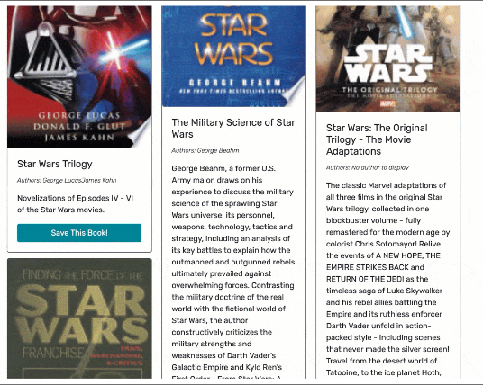

# Book Search Engine

 []
 
 ## Description:
 Book search engine built with GraphQL API and Apollo Server. The app has a React front end /MongoDB database, and Node.js/Express.js server

## Contents
  
  
  2. [Installation](#installation)
  
  3. [Usage](#usage)
  
  4. [Contributing](#contributing)
  
  5. [Tests](#tests)
  
  
## Installation:
  
  clone the repository.
  
  ---
  
## Usage:
 
 To utilize the Book Search Engine: Go to VScode. Run "npm run develop" in the root directory. React will open the application in your browser for you.

  ---
 
  ## License
  
  License used for this project - MIT
  [![License: MIT]](https://opensource.org/licenses/MIT)
  
  ---
  
  ## Contributing:
  
  Please follow these instructions to contribute to the project:
  create pull request from seperate branch and await approval
  
  ---
  
  ## Tests:
  
 `npm test` Launches the test runner in the interactive watch mode.\
    See the section about [running tests](https://facebook.github.io/create-react-app/docs/running-tests) for more information.

  ---
  
  ## Questions
  
  * GitHub Username: WSCoding
  * Link to Github user profile: github.com/whitspa
  * Email Address: whitspa64@duck.com

## Link to github repository
https://github.com/whitspa/booksearchengine

## Link to the deployed application
https://
  
 
  A screen shot of the application is below:

